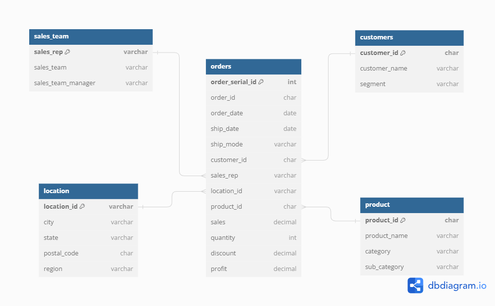

# Projet ETL avec Docker, PostgreSQL, pgAdmin et JupyterLab

Ce projet propose une configuration Docker pour exécuter un processus ETL (Extract, Transform, Load) sur des données de ventes de la base de données SuperStore. Le processus ETL extrait les données d'un fichier CSV, les transforme selon les besoins et les charge dans une base de données PostgreSQL. Il utilise également pgAdmin pour gérer la base de données via une interface web et JupyterLab pour explorer et visualiser les données.

## Prérequis

- Docker installé sur votre système. [Guide d'installation Docker](https://docs.docker.com/get-docker/)
- Un navigateur web pour accéder aux interfaces utilisateur (pgAdmin et JupyterLab).

## Structure du répertoire

```
superstore-etl-project/
├── data/
│   └── SuperStoreData.csv
├── etl/
│   ├── Dockerfile
│   ├── etl.py
│   └── requirments.txt
├── images/
│   └── erd.png
├── notebooks/
├── docker-compose.yml
├── .env
└── README.md
```

## Configuration

1. Clonez ce dépôt sur votre machine :

    ```bash
    git clone https://github.com/mnassrib/superstore-etl-project.git
    cd superstore-project
    ```

2. Ouvrez un terminal dans le répertoire du projet et exécutez la commande suivante pour démarrer les services Docker :

    ```bash
    docker-compose up --build
    ```
    ---
            - Pour savoir les noms des conteneurs Docker en cours d'exécution

            ```bash
            docker-compose ps
            ```

            - Pour vérifier les logs d'un conteneur

            ```bash
            docker logs "nom du conteneur"
            ```

            - Pour appliquer des modifications, reconstruire et redémarrer les services Docker

            ```bash
            docker-compose down
            docker-compose up --build
            ```
    ---

3. Une fois les conteneurs démarrés, vous pourrez accéder aux services suivants dans votre navigateur web :

    - **pgAdmin** : [http://localhost:8080](http://localhost:8080)
    - **JupyterLab** : [http://localhost:8888](http://localhost:8888)

## Contenu du projet

- **data/** : contient le fichier CSV contenant les données de vente.
- **etl/** : contient le script ETL et son Dockerfile.
    - `Dockerfile` : fichier Dockerfile pour construire l'image Docker du service ETL.
    - `etl.py` : script Python exécutant le processus ETL.
    - `requirments.txt` : fichier texte pour spécifier les dépendances et les packages Python nécessaires au projet.
- **images/** : contient les images utilisées dans le README.md.
    - `erd.png` : Entity Relationship Diagram (ERD) illustrant la structure des tables de la base de données SuperStore.
- **notebooks/** : pour contenir les fichiers notebooks pour les analyses et visualisations des données. 
- **docker-compose.yml** : fichier de configuration Docker définissant les services et leurs paramètres.
- **.env** : fichier stockant les variables d'environnement pour la configuration de la base de données où chaque ligne contient une variable suivie de sa valeur.
- **README.md** : fichier fournissant des instructions sur la configuration et l'utilisation du projet.

## Utilisation

1. Connectez-vous à pgAdmin en suivant les instructions d'identification suivantes :

    - **Connexion à pgAdmin :**
        - **Email** : utilisez l'adresse email que vous avez spécifiée pour pgAdmin dans le fichier `.env`.
        - **Mot de passe** : utilisez le mot de passe que vous avez spécifié pour pgAdmin dans le fichier `.env`.

    - **Enregistrez un nouveau serveur :**
        - Faites un clic droit sur "Servers" > "Register" > "Server..."

    - **Configurez le serveur :**
        - **Onglet "General" :**
            - **Name** : entrez un nom pour le serveur, par exemple : `PostgreSQL`.
        - **Onglet "Connection" :**
            - **Host name/address** : utilisez le nom du service Docker PostgreSQL défini dans le fichier `docker-compose.yml`. Par exemple, `db` si votre service PostgreSQL est nommé `db`.
            - **Port** : 5432
            - **Maintenance database** : utilisez le nom de la base de données que vous avez spécifié dans le fichier `.env`.
            - **Username** : utilisez le nom d'utilisateur que vous avez spécifié dans le fichier `.env`.
            - **Password** : utilisez le mot de passe que vous avez spécifié dans le fichier `.env`.
            - **Save password?** : cochez cette case pour enregistrer le mot de passe.

    - **Enregistrez les paramètres :**
        - Cliquez sur "Save".

    ---

    #### Exemple de fichier `.env`

    Pour référence, voici un exemple de fichier `.env` contenant les variables nécessaires :

    ```env
    DB_HOST=db
    DB_NAME=mydatabase
    DB_USER=myuser
    DB_PASSWORD=mypassword
    PGADMIN_DEFAULT_EMAIL=admin@example.com
    PGADMIN_DEFAULT_PASSWORD=admin_password
    ```

    ---

2. Utilisez pgAdmin pour explorer, interroger et gérer la base de données PostgreSQL.

3. Connectez-vous à JupyterLab avec le token d'accès affiché dans la console au démarrage.

4. Utilisez JupyterLab pour explorer, analyser et visualiser les données à l'aide de notebooks Python.

## Auteurs

- [B. Mnassri](https://github.com/mnassrib) - Développeur principal

## Note

Les données utilisées dans ce projet, ainsi que la normalisation des tables de la base de données, sont inspirées de l'article intitulé "[DATABASE DESIGN: BUILDING A BUSINESS DATABASE FROM A CSV FILE](https://medium.com/@oluwatobiaina/database-design-building-a-business-database-from-a-csv-file-5698e87b1e78)" rédigé par l'auteur O. Aina. Cet article offre une approche détaillée pour concevoir une base de données à partir d'un fichier CSV, ce qui a servi de base pour la conception de la structure de la base de données SuperStore dans ce projet.

## Entity Relationship Diagram (ERD)

L'Entity Relationship Diagram (ERD) ci-dessous illustre la structure des tables de la base de données SuperStore :



- **orders** : table principale contenant les informations sur les commandes.
- **customers** : table contenant les informations sur les clients.
- **product** : table contenant les informations sur les produits.
- **sales_team** : table contenant les informations sur l'équipe de vente.
- **location** : table contenant les informations sur les emplacements.
